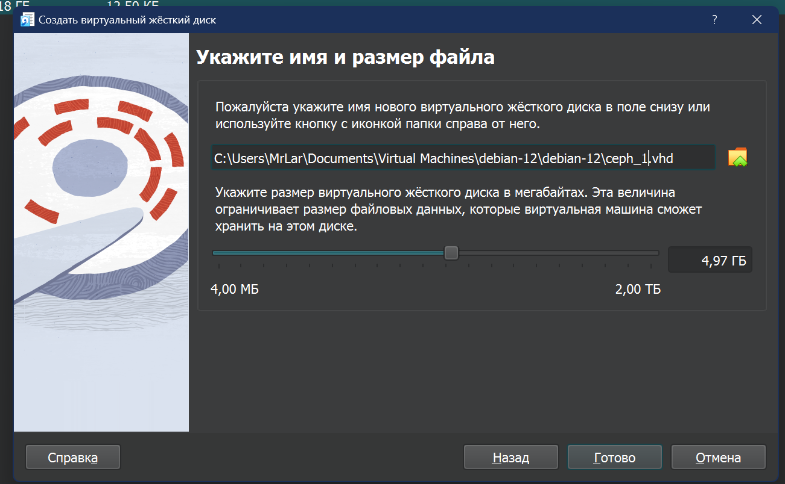
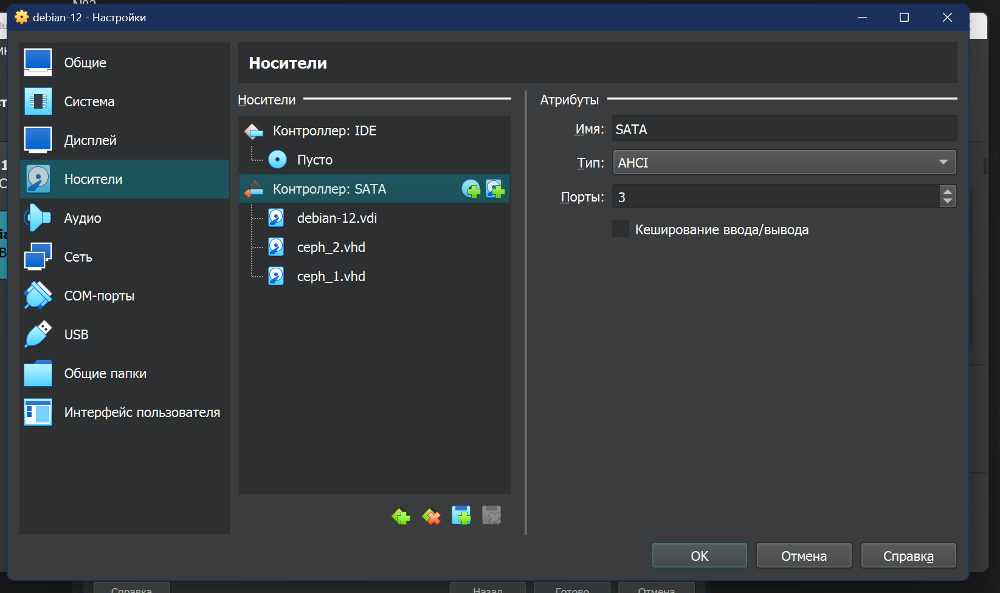
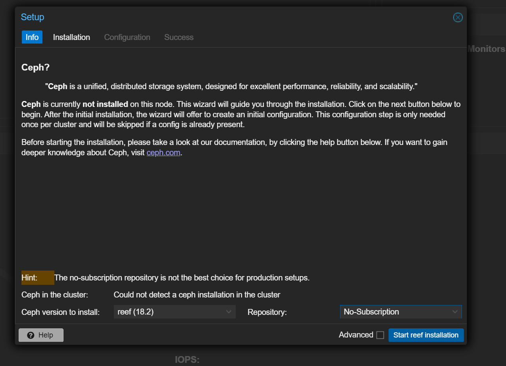
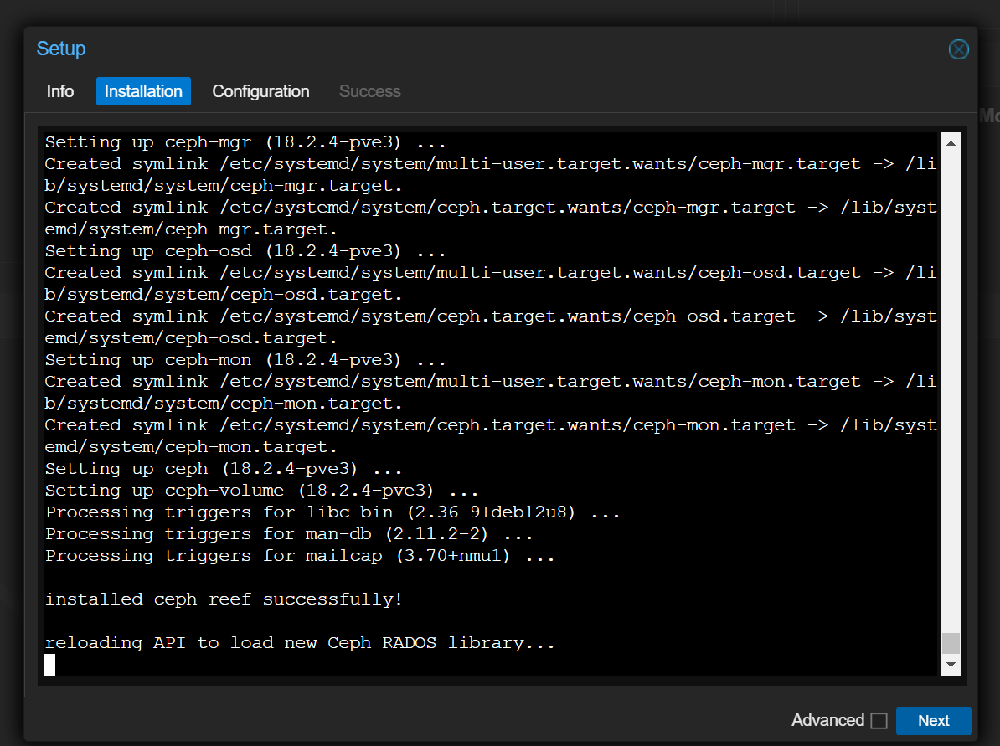
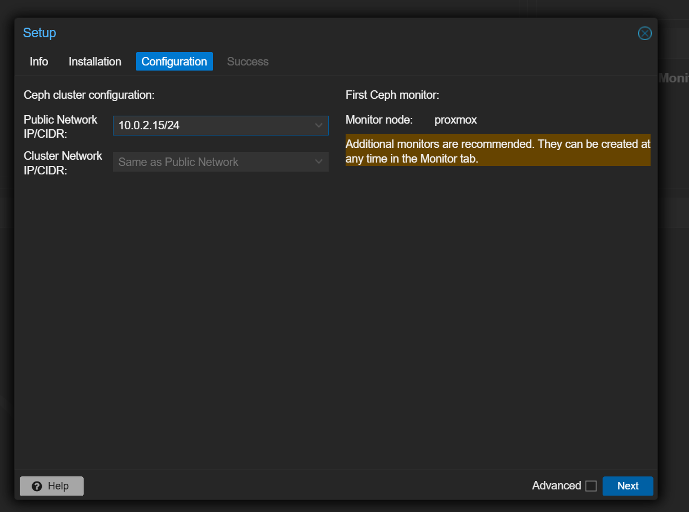
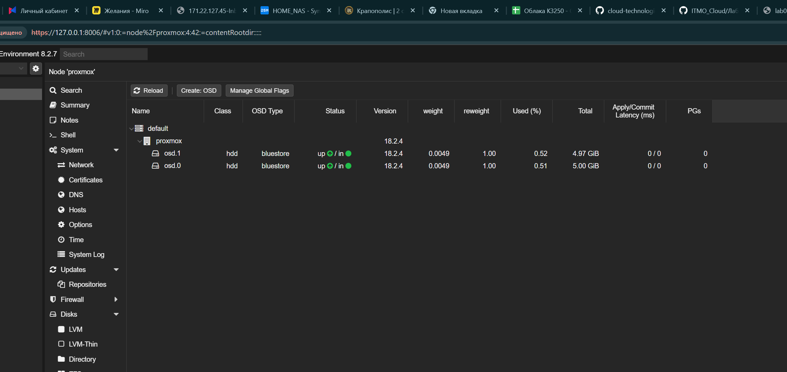

## Цель работы:
Установить и настроить объектное хранилище Ceph для работы с Proxmox.

## Выполнение работы

### 1. Подготовка.
Необходимо запустить виртуальную машину с proxmox, настроенную в лабораторной работе №2.  
Для установки и настройки Ceph, нам необходимо иметь дополнительные диски, которые не используются самим Proxmox. Поэтому создадим и подключим к нашей виртуалке два диска. В Virtualbox выбираем пункт `Настроить → Носители → Контроллеры SATA → Добавить Жесткий диск → Создать`.  
Зададим следующие параметры:

- Формат: VHD
- Объем: 5 Гб
- Имя: называем ceph_1 и ceph_2

Мы подключили оба созданных диска по 5гб каждый.

Запускаем виртуалку, заходим по нужном адресу в браузере и понимаем, что мы забыли пароль. Руки уже потянулись сбрасывать пароль через GRUB, но своевременно пришло осознание того, что пароль был указан в первой лабе. 

Входим и видим два наших новых диска

Идем ставить Ceph

Установка завершена

Завершаем конфигурацию
Видим желтый статус 

Добавляем два диска

Теперь создаем пул (DeadPool)

Идем создавать еще один NextCloud, выбрав в качестве диска наш пул

Из отличий выставляем в качестве диска наш пул

После завершаем настройку и осознаем, что у нас ничего не работает. 
В чате Никита писал, что нужно использовать больше 2х дисков. Но тут надо конкретно разбираться (

**Вопрос: Чем объектное хранилище отличается от обычного? Своими словами**

Ответ: в объектном хранилище данные хранятся в виде объектов (удивительно!), это некие абстракции, содержащие сами данные и метаданные. В отличии от файлового хранения, объектное не имеет четкой иерархии и структуры, все управление осуществляется через ID объекта и его метаданные. (Не следует забывать, что по факту все данные все-равно хранятся в файловой системе на диске). Объектное хранилище благодаря отсутствию иерархии и высокой степени абстракции позволяет реализовать множество возможностей: геораспределение, деление на горячие и холодные данные 
